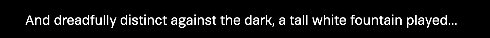
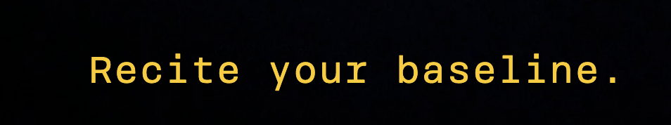
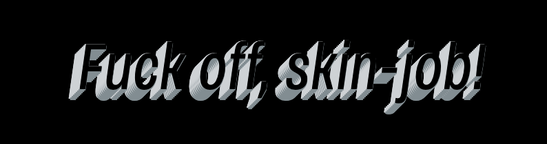

# Web Typography, 2020/2021

Naam: Coen Janssen
Studenten Nr.: 500851877
Datum: 26 oktober 2022

`Algemeen` 
Als je doof bent, of als je om een andere reden geen geluid kunt horen, dan mis je veel informatie als je een film kijkt. Knisperende voetstappen, langzaam aanzwellende muziek, nerveus getik op een deur, je hoort het natuurlijk allemaal niet. Nu bestaat er zoiets als *closed caption*, wat een type ondertiteling is waarbij ook dingen als omgevingsgeluiden en de muziek beschreven worden. Hierdoor krijgt een kijker die informatie wel binnen.

Alleen wordt die auditieve informatie nogal neutraal beschreven. Het geluid van huilend persoon zou bijvoorbeeld beschreven kunnen worden als *snikgeluid op de achtergrond*. En iemand die lacht zou geschreven kunnen worden als *iemand lacht.* Heel neutraal, bijna zakelijk, en bovendien allebei in precies hetzelfde neutrale lettertype. Terwijl het toch echt over twee heel verschillende emoties gaat. 

Dat kan visueel sterker en leuker. Én dat is precies wat hier gedaan is. 

## Leerdoelen & Introductie

Voor het vak webtypografie kunnen we weer aan de slag met het deels verwaterde HTML en CSS. De opdracht is om een gedeelte te gaan vormgeven van 'Blade Runner 2049', maar dan niet in eerste instantie om het 'mooi' te maken. In dit geval is het de bedoeling om een video fragment interessanter te kunnen maken voor dove- of slechthorende mensen. Hiervoor wordt voornamelijk CSS ingezet om de beleving een upgrade te geven en het interessanter te maken om naar te kijken. 

De uitdaging is voor mij is om weer eens goed in de code te duiken en voornamelijk in te gaan zetten op animaties en achtergrond effecten, want ik begrijp ook dat *speelse muziek* tekstueel niet erg spannend is. Hierdoor wordt er ingezoomd op de kleinste, grootste of vervelendste geluiden die je direct of in de achtergrond hoort. Daarnaast zal de typografie ook een kleine touch krijgen. Al moet die niet te extreem worden, want dit is toch een kern-element voor degene die het zonder geluid moeten doen.

## Typografie

De typografie, in dit geval specifiek: de ondertiteling, is natuurlijk essentieel voor een dove persoon om iets van de context van een video mee te krijgen. Naast dat het beeld sprekend is of kan zijn, wordt natuurlijk het verhaal verteld via gesproken tekst door de acteurs en wordt het levendig gemaakt door de geluiden en muziek. 

Gezien er in dit fragment enorm veel harde en enorm vervelende achtergrond geluiden zitten verwerkt (sound fx's), leek het mij genoeg om de tekst eenvoudig te houden en meer de focus te zetten op de achtergrond geluiden. Hierdoor blijft de tekst goed leesbaar en zou een doof persoon de tekst kunnen lezen en tegelijertijd goed kunnen genieten van de special effects die ik er door middel van CSS en HTML erin heb gezet. 

`Optie 1: Systeemfont` 

Ik heb ervoor gekozen om geen gebruik te maken van het systeem font, dit met eigenlijk twee verschillende redenen. De eerste reden is dat je geen controle hebt tijdens het ontwerpen over hoe het font wordt weergeven op verschillende systemen en devices. Reden twee is dat het lastiger is om een verschil te maken tussen de verschillende 'voices' binnen het videofragment.

`Optie 2: Brenner (GEKOZEN)` 

Het Brenner font biedt meer mogelijkheden gezien dit een erg uitgebreide font-family is. Zo bevat deze 'family' onder andere een Sans, Mono en Script variatie. Deze Mono-variant vond ik enorm goed passen bij de soort 'robot' achtige stem die je hoort interacteren met de hoofdrol speler in binnen dit fragment. Dit in combinatie met de officiele gele kleur van ondertiteling (jaja, dat heb ik gegoogled!) laat goed het verschil zien tussen A en B. 

## Stemmen

`Stem 1 (voice 1)` 
Deze eerste stem is de 'robot' achtige stem die interacteerd met het hoofdpersonage. Gezien deze vragen stelt, heeft deze een gele kleur de monospace variant uit het Brenner font. Dit past enorm goed, gezien dit helemaal de look&feel heeft van een systeem, device of robot. Daar denkt iedereen toch aan bij een Monospace font?

`Stem 2 (voice 2)` 
Het hoofdpersonage heeft een wat saaie, vooral lage, mannelijke stem. Deze voelt wel wat krachtig aan waardoor deze een font-weigth van 500 heeft. Hierdoor is die redelijk 'normaal' maar heeft die net die ene extra touch. Daarom heb ik hier de Sans variant van het Brenner font voor hem gekozen. Goed leesbaar en passend.

`Stem 3 (voice 3)` 
Dan valt er toch iets op, in de 'wandelgang' binnen de scene roept er ineens iemand 'fuck off, skinjob!'. Gezien dit zo los staat van de overige teksten van de ondertiteling moest ik hier een vet effect op loslaten. Waar het font verder gewoon de Sans bevat heb ik hier juist wat toffe CSS element op losgelaten. 

## Design Principles

`Exclusive Design Principles` 
Dit principe is van toepassing op de basis van deze opdracht. Hierbij ontwerp je namelijk een product voor een specifieke doelgroep, in ons geval dove personen. Hierbij is het uitgangspunt natuurlijk om het video fragment zo te ontwerpen dat deze zonder geluid interessant is om naar te kijken. Dit is onder andere getest tijdens de werkgroepen door medestudenten naar mijn werk te laten en kijken (zonder geluid) en hen te observeren door naar hun uitingen te kijken: vinden ze het leuk, irritant?

`Study Situation` 
Om zelf goed de situatie te bekijken heb ik de video een aantal keer mét en ook een zelfde aantal keer zonder geluid gekeken. Hierdoor kun je je al voor een goed deel inleven in de doelgroep. Daarnaast heb ik thuis op de televisie ook een keer het geluid uitgezet en ondertiteling aan, dit was dé inspiratie om er ook voor te kiezen om het officiele (volgens Google) gele kleur van de ondertiteling te gebruiken. 

`Ignore Conventions` 
Tijdens het kijken van televisie (zonder geluid) merkte ik dat het ontzettend vervelend is wanneer er *spannende muziek* komt te staan in beeld als tekst. Dit omdat bijvoorbeeld iemand die vanaf zijn of haar geboorte al doof is dit lastig zou kunnen inbeelden (lijkt me). Ik denk daarom dat deze opdracht het wel heel interessant maakt voor doven om een video of film te gaan kijken. 

Ik heb deze met die reden ook niet toegevoegd en heb geprobeerd om deze geluiden door middel van achtergrond video's, animaties en kleur-effecten na te bootsen. 

`Prioritise Identity` 
Je merkt tijdens het kijken van dit stuk film-fragment dat het een Sci-Fi achtige film is, daarin komt natuurlijk data erg naar voren. Daarom de keuze om binnen de film scene de vormgeving te hanteren en deze bijpassend te kunnen maken. Ik denk dat door de keuzes in de achtergronden (ruimte en data) dat de sfeer, ofwel de identiteit van de film, goed tot zijn recht blijven komen. De toegepaste effecten zijn soms subtiel en soms ook lekker in-your-face, zo blijft het toch een echt 'film effect'.

`Add nonsense` 
Dit vind ik zelf altijd erg lastig om te doen, want dit gaat redelijk tegen het principe in van een designer. Toch heb ik erg mijn best gedaan om bijvoorbeeld bij het stukje 'fuck off, skinjob!' een redelijk extreem effect toe te passen op de ondertiteling. Dit maakt het eigenlijk wel leuk, zo kun je door wat 'nonsense' toe te voegen het stiekem nog interessanter maken om naar dit film-fragment te kijken. 

## Feedbacksessies

Zowel binnen als buiten de werkgroepen heb ik open gestaan voor feedback, voornamelijk van klasgenoten. Dit met als reden dat zij zelf ook helemaal in de opdracht zitten en daarmee ook hun eigen inbreng en kijk op het werk kunnen geven (en tsja, soms rijden er geen treinen - en mis je een sessie). In dit geval heb ik de eerst volgende werkgroep en via contact per WhatsApp actief gezocht naar feedback. 

Naast kleine feedback puntjes, die de details hier en daar net iets scherper hebben kunnen zetten - waren dit voor mij een aantal doorslaggevende punten: 

- 'Probeer je niet te focussen op mooi, leef je uit.'
*Dit heb ik inderdaad losgelaten en ben redelijk out-of-the-box gegaan met een ontwerp wat ik in normale situaties nooit zomaar zou maken.*
- 'Je hebt geen echte opening, misschien kun een logische start maken.' 
*De video komt nu in via een animatie en zweeft vervolgens een beetje, waarbij het in eerste instantie er al stond en stilstaand startte.*
- 'Maak niet alleen gebruik van achtergrond video's, dat is misschien te simpel.'
*Ik had goede beelden gevonden, passend bij de scene. Na deze feedback heb ik gekeken of ik het (oranje) alarm na kon bootsen met alleen een stukje CSS.*
- 'Fuck off, skinjob!' wordt niet benadrukt, dit is best een belangrijk onderdeel.'
*Eerst had ik deze alleen vergroot, aan de hand van deze feedback leek mij het een goed idee om iets leuks met CSS te doen om dit vetter te maken!*
- 'Het interview in de geisoleerde cel, kan wel wat spannender worden.'
*Alleen een vette data achtergrond is inderdaad niet genoeg, zeker niet met die irritante pieptoon, hierdoor heb ik de video vervelend laten bewegen - met de piep mee.*

## Experimenten

Tot slot, heb ik enorm veel geprobeerd. Helaas werkte (en nog steeds niet) mijn GitHub desktop niet - hierdoor is niet alles van mijn probeersels opgeslagen. Ook deels doordat ik hier en daar wat probeer, bekijk en als het niet werk direct weer aanpas. Zo zorg ik ervoor dat mijn code voor mij overzichtelijk blijft. 

Een aantal experimenten die ik gedaan heb zijn:
- Het positioneren van de teksten.
- Het opmaken van de ondertiteling met box-shadows, omlijningen en andere effecten. 
- Het laten bewegen van het frame via meerdere animatie-combi's. 
- Het op de seconden animaties te plaatsen.
- Het toevoegen van een video op de achtergrond (was veel zoekwerk, bleek simpel).
- Het nabootsen van de video van het alarm. 
- De combinatie maken tussen de achtergrond en het videofragment (mask).

## Reflectie

Het was leuk om even out-of-the-box aan de slag te kunnen gaan en juist niet te perfectionistisch aan de slag te gaan. Leuk om na een lange tijd ook weer met HTML en CSS bezig geweest te zijn, het was aardig weggezakt omdat ik het niet dagelijks gebruik. Daarmee was het ook direct een behoorlijke uitdaging. 

Al met al denk ik dat ik dit stuk film-fragment een leuke toevoeging heb kunnen geven waardoor het zonder geluid toch leuk is om naar te kijken. Verder heeft het mij wel een goed gedachtegoed meegegeven om binnen mijn toekomstige ontwerpen iets verder te kijken dan alleen een normale situatie maar ook rekening te houden met 'exclusive design'. 

